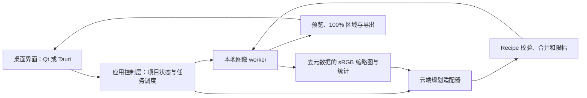

# iPhoto 可行性与桌面技术选型调研

调研日期：2026-09-22。依据：用户提供的《AI 本地无损修图工具：技术方案》V1.0，以及下文链接的一手资料。本文是评审建议，不代表技术栈已经定案，也未开始实现文档中的开发任务。

**判断：值得做一个范围受控的原型；原方案的职责划分成立，但尚不足以作为完整开工规格。** Electron 不是必要条件。当前项目目录没有已有界面代码，不存在为了迁就旧界面必须保留 React 的约束。平台暂按原文 Windows 10/11 评估；用户尚未确认是否同时支持 macOS。

最适合首先验证的产品是：单张人像 JPEG，通过自然语言完成轻量调色、脸部提亮，支持参数微调、撤销和原分辨率导出。难点依次是效果是否自然、预览与导出是否一致、自动建议是否稳定，最后才是桌面框架选型。

**核心方向为什么成立**

“视觉模型理解意图 → 有限参数 → 本地确定性渲染”有研究先例。JarvisArt 使用模型协调 Lightroom 修图工具；RetouchIQ 研究从用户指令生成可执行图像调整。这些工作支持路线的可行性，但其中包含专门训练、工具适配与评测，不能推导出任意通用视觉 API 加一个 Prompt 就能稳定得到相同质量。[JarvisArt](https://arxiv.org/abs/2506.17612)、[RetouchIQ](https://arxiv.org/abs/2602.17558)。

原文值得保留的设计包括：不做生成式重绘；本地检测与云端规划分离；原图不覆盖；Recipe 白名单；用户覆盖参数独立保存；JPEG 先行；算法原型先于完整桌面界面。

产品价值仍需单独验证：自然语言输入是否比“自动优化 + 两个滑杆”更好用。建议将本地保守预设、AI 建议、人工参考同时纳入比较。如果 AI 没有增加稳定收益，就不应让每一次微调都依赖云端。

**不使用 Electron 的选择**

| 方案 | 界面原理 | 对 iPhoto 的意义 | 主要代价 | 建议 |
| --- | --- | --- | --- | --- |
| Tauri 2 + React/TypeScript + Python worker | 系统 WebView；Windows 为 WebView2 | 保留前端开发体验，可以继续用 Python 图像生态 | 仍有浏览器运行时；TS、Rust、Python 三套构建链；跨系统 WebView 有差异 | 接受 WebView、熟悉 React 时首选 |
| Qt 6 + PySide6 + Qt Quick/QML + Python worker | Qt 场景图绘制，不需要 WebView | UI 与图像调试都能围绕 Python 展开；适合自定义照片画布 | 需要 QML/Qt 经验；Qt、Python、模型仍会占包体；打包与色彩显示要验证 | 无既有前端包袱、希望摆脱浏览器时优先 |
| Avalonia + C# | 默认通过 Skia 绘制控件 | 不依赖 WebView，可跨平台，适合 .NET 团队 | 如继续用 Python 就增加跨语言进程通信；改用 C# 需重做算法胶水层 | 熟悉 C# 时有竞争力 |
| WinUI 3 + C# 或 C++ | Windows 原生 UI 框架 | Windows 集成直接；适合明确只做 Windows | macOS/Linux 界面需要另做；图像管线仍需自己接入 | 平台限定 Windows 时考虑 |
| Qt 6 + C++ 图像引擎 | Qt 绘制，原生编译 | 对图像内存、线程与 GPU 的控制更直接 | 初期算法迭代和工程门槛更高 | 有 C++/图像工程积累时可直接用，否则后置 |

Tauri 官方确认 Windows 使用基于 Chromium 的 WebView2，并提供外部可执行文件 sidecar 支持，Python 无需先重写成 Rust。它能减少随应用重复分发的组件，但不能推导出 iPhoto 完整安装包或整机内存会小到某个数值。离线捆绑 WebView2 还会增加体积。[Tauri WebView](https://v2.tauri.app/reference/webview-versions/)、[sidecar](https://v2.tauri.app/develop/sidecar/)、[Windows 安装](https://v2.tauri.app/distribute/windows-installer/)。

Qt Quick 使用图形 API 渲染场景图；Avalonia 默认自己绘制控件。二者“不依赖浏览器”不等于“每个控件都是操作系统自带控件”，也不意味着图片处理自动获得 GPU 加速。WinUI 3 则是微软的 Windows 原生桌面 UI 框架。[Qt Quick](https://doc.qt.io/qt-6/qtquick-visualcanvas-scenegraph.html)、[Avalonia 架构](https://docs.avaloniaui.net/docs/fundamentals/cross-platform-architecture)、[WinUI 3](https://learn.microsoft.com/en-us/windows/apps/winui/winui3/)。

我的暂定倾向是 Qt/PySide6：新项目、Python 算法优先、没有已验证的 React 复用需求。但如果开发者主要熟悉 React，Tauri 通常是更合适的起点。用户目前希望先比较两条路线，尚未选择；不把这一倾向写成最终决定。

PySide6 有官方部署工具 pyside6-deploy。Qt/PySide6 的开源/商业许可需要按实际使用模块和分发方式处理，模型权重也需独立检查；不能只看封装代码仓库的许可证。[Qt for Python](https://doc.qt.io/qtforpython-6)、[部署工具](https://doc.qt.io/qtforpython-6/deployment/deployment-pyside6-deploy.html)。

**原设计需要补齐的技术内容**

| 原设计假设 | 问题 | 建议修改 |
| --- | --- | --- |
| “本地无损修图” | JPEG 导出会重新编码；调色、降噪和锐化都会改变像素 | 对外称“非破坏式编辑”：保留原图、保存参数、可撤销；不能承诺零压缩损失或纹理绝对不变 |
| 模型直接输出精确滑杆数值 | 合法 JSON 不等于数值合适；模型不了解尚未定义的自研曲线响应 | 固定算子后提供校准案例；本地生成基准参数，AI 做有限修正；渲染后检测并回退 |
| 第二轮不必上传图片 | 只适用于明确数值调整；“肤色脏了”“光圈明显”等反馈需要看到当前结果 | 简单微调用 Recipe 和统计；需要视觉判断时上传当前缩略图，可附原图缩略图，限制复核次数 |
| MediaPipe + ONNX Runtime 直接组合 | MediaPipe Tasks 的相关模型使用 TensorFlow Lite/任务包；不能直接交给 ONNX Runtime | 原型选 MediaPipe Tasks 整套运行，或选择具有明确来源和许可的 ONNX 模型；不把格式转换当免费步骤 |
| 人像分割能给出皮肤、眼、眉、唇 | 类别随模型变化；普通主体分割只有人/背景 | 区分主体分割、脸部关键点和 face parsing；用真实类别清单定义允许的语义蒙版 |
| 1K 蒙版放大即可导出 | 小脸、发丝、眼镜、帽檐等细节无法从低分辨率凭空恢复 | 保存标准蒙版；关键脸部用原图裁剪推理；高质量蒙版产生后同步刷新预览 |
| 所有半径统一按长边缩放 | 羽化、降噪、纹理和输出锐化的物理意义不同 | 羽化可按几何尺寸定义；细节算子明确工作尺度；100% 视图从原图区域渲染 |
| 全局红橙 HSL 能改善肤色 | 同样会影响红衣、木墙、橙色背景；不同肤色没有统一目标色 | 肤色专用调整限定于可靠蒙版；保留人工修改，限制色相漂移，覆盖不同肤色测试 |
| 线性化 sRGB 就有 RAW 工作流 | JPEG 已经经过相机处理，反转传递函数不能恢复传感器数据和高光 | 分开定义 JPEG 调色与未来 RAW 显影；先读取输入 ICC，再做工作空间转换 |
| 同 Recipe 在任何时候完全一致 | 模型、蒙版、色彩配置、运行后端、编码器变化都可能改变结果 | 固定渲染输入及版本；同固定后端测像素一致，跨平台测明确容差；不要求每次云端重分析一致 |
| pyvips 加入后自然省内存 | 整图转为 NumPy 数组再做全图复制，会失去按需处理优势 | 从数据流设计分块；需要邻域的算子加入重叠边界；全局统计先算一次 |

结构化输出的官方文档也明确要求处理符合 Schema、但语义错误的结果。因此参数限幅和渲染后的验证应由本地逻辑负责；`preserve_identity: true`、`allow_clipping: false` 只是意图声明，不是算法保证。[Gemini 结构化输出](https://ai.google.dev/gemini-api/docs/structured-output)。

MediaPipe 的主体模型只有人和背景；其多类别自拍分割模型包含头发、身体皮肤、脸部皮肤、衣服等，输入分辨率为 256×256，没有独立的眼眉唇类别。Face Landmarker 的关键点也不等于皮肤像素分割。它们适合做起点，是否满足照片编辑边缘质量仍需测试。[分割类别和模型](https://developers.google.com/edge/mediapipe/solutions/vision/image_segmenter)、[关键点模型](https://developers.google.com/edge/mediapipe/solutions/vision/face_landmarker)、[FaceLandmarker 模型接口](https://ai.google.dev/edge/api/mediapipe/python/mp/tasks/vision/FaceLandmarker)。

色彩链路建议明确为：读取输入 ICC 和 EXIF 方向 → 转换到定义好的工作空间 → 在线性 RGB 执行曝光和相应混合 → 按各算子定义处理色调与颜色 → 输出映射到 sRGB → 嵌入输出 ICC。预览和导出共用色彩转换与算子定义。显示器 ICC、广色域屏幕和 Windows HDR 模式需要专门测试，不能仅靠“导出带 sRGB profile”保证画布所见与外部查看一致。Pillow 的 ImageCms 提供 ICC 转换接口；这只是可用组件，仍需验证位深和具体处理路径。[Pillow ImageCms](https://pillow.readthedocs.io/en/stable/reference/ImageCms.html)。

白平衡参数尤其需要补定义：对于 JPEG，`temperature_mired_shift` 必须说明参考白点、偏移方向、色适应方法和限幅。仅有单位和范围还不能让不同实现保持一致。`shadows`、`contrast`、`texture` 也应有曲线、色彩空间、边界和顺序规范。

**Recipe 应保存到什么程度**

建议把说明文字、云端建议、最终渲染状态分开。渲染状态至少记录：

- 原文件内容哈希、方向归一化约定、输入 profile 标识。
- Schema、算子实现和引擎版本；固定处理顺序。
- 最终生效参数、用户锁定字段、稳定的局部调整 ID。
- 蒙版内容哈希与可用数据；检测模型版本、裁剪变换、稳定 subject ID。
- 输出尺寸、profile、编码选项。
- 云端分析另存模型/Prompt 版本和请求上下文，用于复盘。

原文用数组索引 `/local_adjustments/0/...` 修改参数，后续插入、删除或重新排序时容易误改对象。应对局部调整分配稳定 ID，并在提交 Patch 时校验基线 revision；多人脸也不能仅依赖每次重新检测后的面积排序。

安全限幅应对最终合成效果生效。例如全局 +0.7 EV 和人脸 +0.8 EV 可能合计到 +1.5 EV，仅限制局部参数不足以控制结果。检查新增剪切应与原始照片比较，不能要求原本已经过曝的照片导出后“完全没有剪切”。

缓存使用内容哈希和完整上下文；感知哈希只适合相似检索，不宜作为精确 Recipe 命中依据。已有手动修改、蒙版和模型版本、用户意图、基线 Recipe 都可能影响结果。原图路径失效时应支持重新定位并验证哈希；缓存清除不能删除项目复现所必需的唯一蒙版副本。

**更精简的工程架构**

该图是建议架构，不依赖特定云端供应商。控制层掌握文件访问、密钥和任务生命周期；UI 不直接持有供应商密钥。Tauri 方案由 Rust 控制层启动 Python worker；Qt 方案可由 Python 控制层启动独立计算进程。

原文的 FastAPI 能用，但单机桌面第一版不一定需要本地 HTTP 服务。建议优先评估常驻 worker + stdio 管道传小型 JSON 消息，图片通过受控缓存文件或二进制通道传递；共享内存等优化等测到瓶颈再加。避免每次拖动滑杆重新启动 Python，也避免通过 JSON/Base64 来回传整张原图。消息含 request ID、generation、错误和取消状态；丢弃过期结果不等于底层计算已经停止，还要控制队列和并发。

计算任务不占用 UI 线程。原型阶段保留一套 CPU 渲染语义，不先写互不一致的浏览器滤镜预览和 Python 导出。GPU 只在有数据证明需要时引入。推理采用 ONNX 路线时，可先用 CPU 后端；当前 ONNX Runtime 文档对新 Windows 项目建议考虑 WinML，具体 GPU 选型需结合 Windows 版本，而不是默认假设所有 Windows 10/11 都使用同一种加速路径。[ONNX Runtime 安装与后端说明](https://onnxruntime.ai/docs/install/)、[Windows ML 后端条件](https://learn.microsoft.com/en-us/windows/ai/new-windows-ml/supported-execution-providers)。

原型项目存储用项目 JSON、历史和缓存目录即可；需要项目列表或大量导出记录时再加入 SQLite。Schema 保持单一权威定义，其余类型通过生成或契约验证保持同步，避免 TS/Pydantic 各自手写后发生漂移。

**体积与性能要怎么判断**

按 24,000,000 像素计算，一张 RGB float32 图像需要 `24,000,000 × 3 × 4 = 288,000,000` 字节，约 275 MiB；五个这样的缓冲区约 1.34 GiB，尚未计入蒙版、推理运行时、解码、UI 和 GPU 纹理。这是尺寸计算，不是 iPhoto 的实测内存。

因此，换掉 Electron 只能改善部分开销。全图复制次数、中间结果生命周期、导出并发和分块策略同样重要。libvips 支持按区域按需计算，适合研究这一方向；其能力不会自动延伸到任意 NumPy/OpenCV 全图操作。[libvips 技术机制](https://www.libvips.org/API/current/how-it-works.html)。

对两条 UI 路线，应使用同一份渲染引擎、模型和照片做小型验证：空闲状态、打开 24MP、拖动滑杆、100% 放大、导出五种状态。分别记录完整进程树内存、冷启动、打包后体积、预览 P50/P95、导出耗时。区分首次模型加载和热缓存，云端时延单独记录。100–500ms 可以是调参预览目标，但不是 60fps 连续渲染的承诺；网络分析不能计为本地预览耗时。

**能否复用 darktable 或 RawTherapee**

可以。darktable-cli 能读取图片和 XMP 历史并导出；RawTherapee CLI 能应用 PP3 配置。它们值得用作质量基准，或另做“自然语言驱动成熟引擎”的技术试验。[darktable CLI](https://docs.darktable.org/usermanual/development/en/special-topics/program-invocation/darktable-cli/)、[RawTherapee CLI](https://rawpedia.pixls.us/command-line_options/)。

但命令行导出接口不能直接视为供第三方嵌入的实时修图 SDK。若接入，需要维护 Recipe 到其参数/历史格式的映射、锁定版本、管理启动与导出开销，并验证局部蒙版如何传入以及分发条件。这是工程判断，尚未做性能试验。

建议：先用成熟工具建立参考输出，再实现一组小而明确的 iPhoto 算子。如果连基础阴影和肤色效果也需要投入大量研究，及时比较成熟引擎适配路线；避免在没有照片对比的情况下决定重造完整显影引擎。

**隐私表述的修正**

缩略图和脸部裁剪仍会包含可辨识信息。产品应明确“云端收到哪些图片”，不要把“原分辨率不上传”表述为“照片不上传”。上传图应重新生成并去除 EXIF/GPS；导出图的拍摄元数据保留策略另行处理。供应商是否保留请求数据取决于具体服务和账户配置，不能由本地架构保证。

翻转原图像素后必须同步修正导出 Orientation、尺寸及内嵌缩略图等相关元数据，不能原样复制所有 EXIF。可复现要求和“一键清空缓存”也应分开：派生预览可删除，项目唯一的蒙版/历史不能被误删。

**建议的验证顺序**

| 阶段 | 要做的最小工作 | 继续投入的条件 |
| --- | --- | --- |
| 1. 固定参数验证 | 先做方向/ICC、曝光、保守阴影、脸部柔边提亮、sRGB 导出；选择 20–30 张不同光线和肤色照片 | 保持原文件哈希；没有明显脸周光圈；大图导出可完成；样片效果达到用户预期 |
| 2. 验证 AI 的增益 | 相同照片比较本地预设、AI 建议、人工参考；保存失败样例 | AI 在盲测中稳定有用，而不只是输出可解析 JSON |
| 3. 锁定桌面路线 | 根据开发者经验选 Qt 或 Tauri，跑通导入、对比、滑杆、100% 区域和 worker | 安装后的干净 Windows 环境可启动；照片显示及调参响应符合约定 |
| 4. 补齐可用闭环 | 撤销/重做、项目保存、用户覆盖字段、错误恢复、导出 | 项目重开能复现；云端不可用时仍可手调与导出 |
| 5. 扩展人像质量 | 皮肤分割、多人主体、局部暖色和背景处理 | 新能力有单独样片与回归验证，不降低已支持场景质量 |

第一版建议暂缓眼周专修、磨皮、复杂降噪、完整 HSL 面板、RAW、批处理和风格学习；多人场景至少提供明确选择或提示。先验证“全局保守调整 + 一个可靠的人脸局部提亮”，成功后逐项增加。

文档中的 2–4 天适合作为算法探索时间盒，不能当成画质达标承诺；1–2 周闭环也需已有相关开发经验和明确范围。可靠产品的进度应由上述照片与工程验收决定，不宜单靠 UI 功能清单估算。

本次只完成资料查证与设计评审，没有样片效果实测、真实 API 成本测量、安装包构建或性能基准。下一项最有价值的工作是固定参数的小型图像原型，并用用户实际照片决定算法是否过关。
