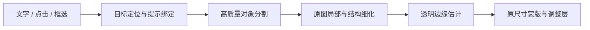

# 精细选区：结构诊断与候选组合

2026-10-03。状态：原图链路已修正，高质量模型与内部孔洞实验继续；本文不代表新模型已接入生产入口或已经达到全部验收条件。

## 复现对象与已确认问题

用户截图对应 `assets/lake.jpg` 左上角的树枝与天空。需要分辨细枝、针叶及枝条间孔洞；另以用户授权的 ppp 大图验证头发、帽檐和人物轮廓。原图及个人设置保持，输出到独立 QA 目录。

1. `worker_bridge._dispatch_pixel` 已发送源路径和 SHA，但 `pixel_worker` 只在面部/身体皮肤任务中加载原图。普通对象进入 `service.segment` 时仍是最长边1600px代理图。
2. `segment` 内部再次缩小代理并阈值化模型 logits，丢弃不确定程度。其原图 matting 分支依赖传入尺寸大于代理尺寸，在普通对象的真实进程入口中没有触发。
3. 普通位图默认按最近邻放大。放大画布和原尺寸导出能显示已有蒙版的真实边界，但不能恢复没有计算的细枝与孔洞。
4. `make_trimap` 仅重新判断既有轮廓附近的窄带；粗选区内部被错误确定为255的天空孔洞，可能成为不可更改的前景约束。增加羽化不解决这种结构错误。

## 本项目优先验证的组合

| 环节 | 优先候选与职责 | 对本项目的要求 |
|---|---|---|
| 目标定位 | 已连接的视觉语言模型；点/框无需云端 | 只定位目标，不把框、多边形当成最终蒙版。 |
| 通用分割 | 当前EfficientSAM即时定位；HQ-SAM2为对照候选 | 第一轮HQ模型没有解决本图内部孔洞，不因为模型较大就自动替换。 |
| 原图细节 | 带上下文的局部重算与重叠拼接 | 从原图取样；输出坐标回映到同一源图，不能把普通放大叫作细化。 |
| 透明边缘 | ViTMatte，保留PyMatting作为可用性后备 | 原图局部RGB加可靠trimap；复查内部孔洞，不把全部粗前景锁定。 |
| 皮肤保护 | 已有专用面部解析与身体分区 | 面部磨皮继续保护眉眼、嘴唇，不复用通用人物轮廓。 |
| 人像 / 主体 | BiRefNet_HR-matting作为专门候选 | 正向人像实测可生成主体alpha；湖景树枝自动前景失败，不将其当任意对象分割器。 |
| 交互与性能 | 轻量模型用于即时反馈，精细结果经独立进程完成 | 状态分为定位、分割、恢复细节、估计边缘；可取消；完成前保留上一版有效范围。 |

本机 `nvidia-smi` 确认为RTX 4060 Laptop、8188 MiB显存。模型实验使用独立QA运行环境，避免改变已验证应用依赖。大图不整张放进matting Transformer：先验证局部切块与上下文，缓存按源SHA、模型版本、局部位置、分辨率区分，并限制CPU/显存预算。

## 官方依据与取舍

- [HQ-SAM](https://github.com/SysCV/sam-hq)针对复杂结构提高掩码质量；[HQ-SAM2](https://github.com/SysCV/sam-hq/blob/main/sam-hq2/README.md)提供更高质量的SAM2检查点，官方仍标为beta，Windows推荐WSL。不能直接把官方COCO指标当成本项目枝条结果。
- [ViTMatte](https://github.com/hustvl/ViTMatte)和[官方Transformers接口](https://huggingface.co/docs/transformers/model_doc/vitmatte)使用图片与trimap估计alpha。[Matte Anything](https://github.com/hustvl/Matte-Anything)说明了分割、约束生成与透明度估计的组合思路。
- [SAM2Refiner论文](https://arxiv.org/abs/2502.09660)结合全局/局部特征、提示对齐和高分辨率解码，支持从架构补足细节的方向；目前本轮尚未确认可直接使用的官方代码/权重，不把论文分数作为已经安装的能力。
- [MaSS13K / MaSSFormer](https://github.com/xiechenxi99/MaSS13K)提供4K、含天空/植被等类别的精细语义基准，可用于后续有标注的比较；其官方环境依赖旧版PyTorch/MMCV，先保留为对照候选。
- [SAM3官方实现](https://github.com/facebookresearch/sam3)擅长概念提示，模型下载需要额外准入，当前修图问题更需要细结构和alpha的证据。后续可作为定位候选比较，尚未替代现有服务。

## 验收标准

先保存原入口同位置、同提示的蒙版与100%截图，再比较候选；未满足标准不自动替换生产结果。

- 针叶和细枝的保留率、天空孔洞误选、边界误差；有标注数据报告边界IoU/alpha误差，自然照片的手工检查不冒充全图真值。
- 点选天空与点选枝条均检查；帽檐、发丝、同色背景另测，不能只优化这一张高反差图片。
- 比较初次编码、重复提示、局部修正耗时和显存峰值；等待可观察、可取消，换图/旧回复不覆盖新目标。
- 100%原像素、蒙版预览、保存重开、原尺寸导出使用同一有效范围；未改区域保持，原图SHA不变。

## 首轮模型实验

原图 `assets/lake.jpg` 为2000×1333；使用官方HQ-SAM2 Large和固定版本ViTMatte-S，在独立CUDA环境运行。取680×450原像素枝条区域，对全图与局部的天空保留点/枝条排除点分别预测，模型未启用填孔或去除小组件。原图SHA不变，进程退出0。

HQ单独输出仍漏掉枝条包围的天空孔洞：全图预测分数0.926，不能据此验收边界。局部HQ-only输出分数0.432，并有碎片噪点。ViTMatte改善外侧边缘与噪点，但由粗分割生成的确定区域仍锁住内部孔洞。此组合首轮未通过用户问题的视觉验收，不自动接入生产。

首轮模型峰值显存约1590 MiB，局部matting约0.75秒；当时完整回归同时运行，不能用作最终性能比较。证据在 `artifacts/ux-cloud-recheck-90/quality-probe-report.json` 和三组已查看的蒙版/叠加图。下一步比较SAM与HQ组合输出，并重做原图结构不确定区，避免仅靠窄带trimap锁死错误内部区域。

当前生产仍使用EfficientSAM-S。上述高质量组合需要实际模型对比与链路回归后再接入。

## 第二轮模型与结构实验

- 比较HQ-only与SAM+HQ组合、选天空与反选枝条、全图与原像素局部。两种HQ输出均保留了粗对象包络，未可靠打开内部天空孔洞。对应quality-variants-report.json及已查看叠加图，进程退出0。
- [BiRefNet_HR-matting官方模型](https://huggingface.co/ZhengPeng7/BiRefNet_HR-matting)采用2048输入、可估计透明度；固定官方版本/代码及safetensors摘要，在独立CUDA环境比较。湖景全图和局部均未把该枝条作为可靠前景，不能反选成天空；正向ppp1607人像输出可见主体范围。三次推理约2.25/1.56/2.00秒、峰值约5120 MiB，尚无全图标注质量验收。初版实验遗漏EXIF旋转，仅实验图像横置；修正为应用同一load_source色彩/方向流程，原错误及复测均保留，进程退出0。
- **结构约束+ViTMatte有改善：** 使用原入口before-lake的真实蒙版，在原图找出排除点所在的粗背景连通域；仅该域中的高反差已知色用于约束，中间色改为unknown，而非锁定全部内部区域。原图543×316局部推理、反向天空alpha，恢复约49677个粗蒙版漏掉的天空像素，域外逐字节不变，局部处理约0.55秒、峰值约306 MiB，进程退出0，叠加图已查看。只处理这两个排除点约束到的域，右侧未关联孔洞仍有漏选；高反差颜色约束不能泛化到同色头发/背景。本轮不把这份实验结果自动提交用户图层。
- 同样结构种子送入当前closed-form solver：默认核心触发max_nnz预算，调整discard_threshold后又缺少局部前景/背景，缩小核心仍有参照缺失。三个失败终态均保留，不增大无界内存预算或把未求解结果当成完成。说明高频内部结构需要不同的约束/上下文与神经matting，单独窄带/CPU求解不能包办。

## 已接入生产的基础修正

前台普通对象按原图细化、模型继续复用同一1600px代理embedding；后台轮廓保留轻量预览并在正式选中时升级。阶段状态可观察、可取消；原图透明度求解失败时使用有界局部颜色贴边，并明确复查提示。范围标签不反复追加算法概念。正式蒙版保留原尺寸并用于保存/重开/原像素合成；它解决分辨率链路和任务可用性，**尚未解决截图内全部天空孔洞**。

当前更有证据的组合是“定位与对象提示 → 原图结构约束 → ViTMatte局部alpha”，人像主体与皮肤走各自专用模型。还需将结构约束推广到没有明确排除点、颜色相近及多个细枝域，并完成原入口/大图/取消/保存导出验收，再接入GPU候选。不能给出所有场景通用、已验证的单一最佳模型。
