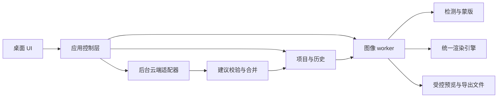

# iPhoto V1 技术方案草案

状态：技术方案继续作为目标设计；用户已要求先制作效果，现有本地原型的实现和验收范围以 [原型验证记录](../../docs/prototype-validation.md) 为准。已确认自用、Windows 优先且保留跨平台、Qt/PySide6，以及人像/风景/室内通用单图修图。云端服务和最终质量目标待确认。

当前实现：app.py 管理 Qt 控制与历史，worker.py 承担进程协议，engine.py 包含浮点参考算子和 65³ LUT 加速，ui/Main.qml 为实际界面。已接入六种全局调整、真实导出和参数保存恢复；暂未接入云端、人脸识别和局部蒙版。以下目标模块按规模增长再逐步拆分。

**设计边界**

建议采用非破坏式参数编辑：保留源文件，以版本化 Recipe 和蒙版记录编辑状态。视觉模型输出允许的调整建议；本地引擎负责渲染。原文件不被覆盖，默认不使用生成式重绘。图片质量通过样片验收确定，不能仅用“JSON 合法”代替效果验收。

独立处理三个版本：项目存储格式、Recipe 算子语义、云端建议格式。云端返回数据经过适配和校验才能转为有效 Recipe，供应商 Schema 的限制不应决定项目长期保存格式。

**技术栈提议及决策点**

| 模块 | 首选提议 | 决策/验证事项 |
| --- | --- | --- |
| 桌面 UI | Qt 6 + PySide6 + Qt Quick/QML | Q-04 已确认；不安排 Tauri 双路线开发 |
| 应用控制 | Python；QML 通过受限 QObject 接口调用 | UI 线程不执行图像计算或同步网络请求 |
| 图像计算 | 独立常驻 Python worker，NumPy/OpenCV 向量化算子 | 图像数据生命周期与性能实验决定是否加入 pyvips 分块管线 |
| 解码与颜色 | 原型使用 Pillow/ImageCms，并单独验证 ICC、量化与输出路径 | 每个输入只做必要的色彩转换，禁止反复 8-bit 中间往返 |
| 本地视觉 | 算法阶段先支持受控脸框/柔边蒙版，再评估 MediaPipe Tasks | 明确模型权重、运行时、输出类别和许可证；不默认可交给 ONNX Runtime |
| 云端 | provider adapter；先实现用户实际使用的一家 | Q-07 决定；模拟响应可以验证流程，不能代替真实模型效果验收 |
| 结构校验 | Pydantic + 导出的 JSON Schema | 单一权威定义；项目/执行契约与云端精简契约分开 |
| 存储 | 项目目录 + JSON + 蒙版文件；缓存另放 | 初期无需数据库；需求出现项目列表时再评估 SQLite |
| 密钥 | 系统凭据存储的封装接口 | Qt/QML、项目 JSON、日志均不能包含密钥 |
| 测试 | pytest；图像夹具、进程集成测试、固定样片人工评分 | 测试范围随实际风险确定，不为简单界面文本写重复测试 |
| 构建分发 | 先验证 pyside6-deploy；版本和产物格式由环境实验锁定 | 开发早期在干净 Windows 测一次，不等全部功能完成 |

依赖不使用无约束的 latest。选定可兼容的 Python、PySide6、图像库与模型运行时组合后生成锁文件，记录模型 SHA-256；具体版本在兼容性实验完成后填写，当前不编造已验证版本。

已选定 Qt 路线。平台差异集中在凭据存储、目录定位和分发适配；图像引擎、项目格式和 Qt 界面避免写死 Windows 路径。当前不承担 macOS 安装和显示一致性验收。

**进程和模块边界**



模块规模增长后的目标布局如下；当前紧凑实现的位置见上方说明，不为未实现能力建立空代码骨架：

```text
src/iphoto/
  app/          项目控制、任务状态、用户操作
  domain/       Recipe、项目、建议、revision、错误类型
  ipc/          worker 消息与任务协议
  engine/       解码、色彩、算子、渲染、导出
  vision/       人脸检测、蒙版生成、模型适配
  cloud/        云端适配、请求构造、建议解析
  storage/      项目文件、受控缓存、系统凭据
  ui/           QML 和受限 QObject 界面桥接
tests/
fixtures/       合成测试图；私人样片使用本机清单引用
scripts/        打包、基准与回归执行入口
```

worker 开发环境通过模块入口启动，打包后通过明确的 worker 模式启动，避免重新进入 UI。Qt 使用 QProcess 管理生命周期。控制层检查 worker 协议版本、能力和健康状态；崩溃后保留最后一次已保存编辑状态，允许重启。

云端调用放到独立后台执行器，避免图像导出占用 worker 时阻断网络取消。原始图片不发送云端；只发送明确生成、去除元数据的代理图与可选裁剪。

**任务协议**

控制消息优先采用 UTF-8 NDJSON，经 stdio 传输。stdout 专用于协议，日志写 stderr。单条控制消息建议上限 1 MiB；像素通过受控文件或后续验证过的二进制通道传输，禁止把整张图片的 Base64 放进控制消息。

| 操作 | 输入摘要 | 结果摘要 |
| --- | --- | --- |
| hello | 协议版本 | 引擎版本、能力集、模型状态 |
| open_image | 经控制层批准的源图引用 | image_id、方向校正后尺寸、profile、文件哈希 |
| analyze_local | image_id | 稳定 subject_id、区域、置信度、蒙版引用 |
| render_preview | image_id、revision、有效 Recipe、尺寸、generation | 预览 asset_id、统计、处理耗时 |
| render_region | image_id、revision、原图区域、缩放倍率 | 区域 asset_id 与坐标变换 |
| export | image_id、固定 revision、受控目标、编码参数 | 导出信息或结构化错误 |
| cancel | request_id | 已取消、请求取消中或已完成 |
| shutdown | 无 | 退出确认 |

每条请求包含 request_id；编辑相关请求包含 project_id、base_revision/revision 和 generation。响应/错误原样回传这些标识。未知字段、无效参数、过期基线和未知图像引用均拒绝进入引擎。

预览采用“一个执行中 + 一个最新待执行”的有界队列，默认合并连续滑杆操作。旧结果不能替换新画面；不能把“丢弃旧响应”误当作底层任务已停止。算子阶段和分块边界检查取消标志；无法中断的原生调用完成后不继续下一个过期阶段。

首次实现导出并发为 1。导出绑定提交时的固定 revision，即使用户继续编辑也不混入新参数。预览资产用唯一文件名，写完后发布；显示中的文件不被缓存清理器删除。

**Recipe 与状态模型**

下面是字段关系示意，尚非最终 JSON Schema：

```json
{
  "schema_version": "0.1",
  "engine_version": "prototype-1",
  "source": {"content_sha256": "...", "orientation_normalized": true},
  "global": {"exposure_ev": 0.0, "shadow_lift_ev": 0.0},
  "adjustments": {
    "adjustment_01": {"subject_id": "subject_01", "mask_id": "mask_01", "exposure_ev": 0.3}
  },
  "adjustment_order": ["adjustment_01"],
  "masks": {"mask_01": {"content_sha256": "...", "asset": "masks/mask_01.png"}},
  "output": {"profile": "srgb", "format": "jpeg", "quality": 95}
}
```

项目另存 ai_base、user_overrides、locked_paths、history 和当前 revision。effective_recipe 是经过合并与校验的不可变渲染快照。局部调整和人物使用稳定 ID，不用会随排序变化的数组下标标识对象。

AI 建议携带 base_revision，只能修改能力白名单内的字段。提交时基线已改变则重新计算差异或标为过期，不静默覆盖用户编辑。撤销/重做记录一次用户操作的前后状态或可逆差异；滑杆一次拖动合并为一步。用户修改字段默认锁定，允许显式解除。

缓存键包含源图内容哈希、有效参数、引擎版本、蒙版内容、输出/预览尺寸及必要色彩配置。云端缓存另包含模型、Prompt、用户意图、当前编辑上下文和上传图内容哈希。感知哈希不用于精确复用最终结果。

**渲染管线与算子规范**

固定流程提议：方向纠正 → 输入 ICC 转换 → 内部 float32 线性 RGB → 全局偏色校正 → 曝光/阴影/高光/对比度 → 饱和度与自然饱和度 → 局部调整 → 输出映射和 sRGB 编码。实现分阶段校准，能力测试通过后才开放给 AI。第一轮不加入锐化、磨皮和降噪，避免无法区分颜色收益与纹理损伤。

通用单图能力分为两层：所有照片都支持全局色调/颜色调整；人脸提亮、天空或其他区域属于具备可靠蒙版时的局部能力。风景与室内不能依赖检测到人脸才完成修图。V1 是否加入天空分割、拉直/裁剪或其他局部能力，要由具体痛点和第 3 轮范围确认决定。

场景策略采用同一引擎、不同建议约束：人像重点控制肤色漂移和脸部光圈；风景重点控制天空高光、阴影层次和过饱和；室内重点处理整体偏色及明暗平衡，混合光无法用一个全局白平衡解决时保守调整并说明能力边界。不为三类场景各写一套互不兼容的像素算法。

基本交互已确认：导入后显示中性图像，用户输入要求后才开始云端规划；结果显示修改摘要、原图对比和继续输入入口。参数面板是可展开的解释/微调入口，其最终复杂度待后续 QA 确认。

曝光明确为乘以 2^EV。阴影使用独立、版本化的亮度权重曲线，参数以 EV 表示，避免把不明语义的 -1～1 数值交给云端。曲线拐点、负值、越界与高光处理在算法实验中确定；通过参考曲线和 golden fixture 固化后才暴露给 AI。

局部提亮用稳定蒙版和线性域合成。最终限幅同时考虑全局和重叠局部调整；新增剪切相对于原图测量，已存在的过曝不误判为算法新引入的失败。无编辑状态保持中性，不自动运行隐藏美化。

JPEG 的暖色/偏色修正需要明确参考白点和色适应方法；如果这一项未通过样片测试，就从云端能力列表中移除，并在界面解释当前能力。不能仅定义 temperature_mired_shift 字段就宣布实现白平衡。

脸部蒙版先支持手动框选/固定脸框，隔离渲染质量和检测质量；自动检测接入后保存稳定的主体与变换。若依赖原图裁剪生成更高质量蒙版，正式提交蒙版前刷新预览；不允许导出阶段悄悄换蒙版而不更新画面。检测失败时降级到全局或手动区域。

预览和导出共用算子实现。窗口预览可使用缩略图；100% 模式读取原图对应区域。非线性处理和缩放一般不满足严格交换关系，因此“预览与导出一致”按选定参考路径和容差验收，而不是对不同尺寸结果要求逐像素相等。

**项目与导出**

项目目录格式提议：project.json、历史文件、必要蒙版和版本信息。源图默认保持外部引用并记录哈希；是否提供“连原图一起保存”由 Q-10 决定。临时预览放在独立缓存目录，清缓存不删除项目复现所需的唯一数据。

保存采用同目录临时文件与替换；导出也先写临时文件，成功后再发布最终路径。目标不得等于源图；文件重名采用明确提示或自动编号，策略由交互需求确定。导出元数据采用白名单：方向与尺寸更新，ICC 与实际输出匹配，旧缩略图不原样保留；GPS 是否保留另行确定。

系统凭据存储通过一个接口封装。凭据不可用时请求重新填写；不退化为明文写项目。日志只记录诊断必要的任务、耗时、错误和版本，移除 Key、图片内容与私人完整路径等不必要信息。

**云端调用与失败行为**

| 情况 | 行为 |
| --- | --- |
| 首次分析 | 原图生成的 sRGB 缩略图 + 用户意图 + 本地统计 + 已实现能力 |
| 明确增减参数 | 可仅使用现有 Recipe、统计和文字；是否省略图片由适配器策略决定 |
| 偏色、边缘、自然度等视觉反馈 | 允许发送当前结果缩略图，按需附原始缩略图；用户能理解本次上传内容 |
| 超时或服务不可达 | 结束本次建议任务，保留当前编辑，手动功能和导出仍可用 |
| 非法/不支持的建议 | 最多一次带校验信息的修复尝试；仍失败则不应用，保留本地基准 |
| 合法但效果异常 | 限幅/降低建议强度并提示；不把异常结果静默加入已确认历史 |
| 用户取消或换图 | 响应到达后按任务标识丢弃，不能修改新项目 |

请求超时、图片尺寸、模型和每次最大调用次数放入集中配置；具体值根据 Q-07 的服务和实测确定。开发流程先接录制/模拟响应，再用真实 API 验证；默认不做无界自动审美迭代。

**性能、兼容与发布验证**

建议基准为 24MP JPEG、1600px 窗口预览、CPU 可运行。具体电脑以 Q-08 为准。性能门槛目前是候选：热预览 P95 ≤ 500ms、24MP 导出 ≤ 15s、编辑/导出全进程树峰值内存 ≤ 1.5GiB。第一轮基准后调整或确认，不伪装为已有测试结果。云端耗时单列，不混入本地渲染指标。

24MP RGB float32 单缓冲约 288MB。通过预览缓存、受控中间数组、局部区域处理和限制并发控制开销；若基准超标，按热点引入分块或 pyvips，禁止只是增加库依赖却继续全图多次复制。分块邻域算子需要重叠边界，全局统计统一计算。

早期打包验证包含：模型文件位置、DLL、无预装 Python、中文路径、应用资源只读、退出时 worker 回收。正式交付再补项目恢复、网络失败、错误报告和完整用户流程。账号、网关、付费、自动更新只在 Q-01/Q-07 明确需要时加入。

技术依据沿用已完成调研：[Qt for Python](https://doc.qt.io/qtforpython-6)、[Qt Quick](https://doc.qt.io/qt-6/qtquick-visualcanvas-scenegraph.html)、[MediaPipe 模型](https://developers.google.com/edge/mediapipe/solutions/vision/image_segmenter)、[Tauri sidecar](https://v2.tauri.app/develop/sidecar/)、[Pillow ImageCms](https://pillow.readthedocs.io/en/stable/reference/ImageCms.html)、[libvips](https://www.libvips.org/API/current/how-it-works.html)。版本冻结、模型权重和实际调用参数在对应实现任务中再次核对。
